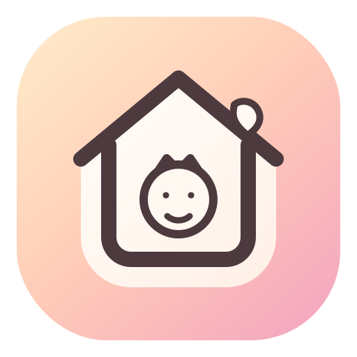
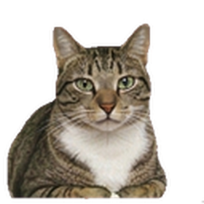

<p align="center">
  
</p>

<h1 align="center">TinyRoommate</h1>

<p align="center">
  <strong>A tiny AI companion that lives on your desktop.</strong><br/>
  It watches your screen, remembers your habits, and occasionally says something that makes you smile.
</p>

<p align="center">
  Built with <a href="https://tauri.app">Tauri</a> · Powered by <a href="https://docs.anthropic.com/en/docs/claude-code">Claude Code</a> (Haiku)
</p>

---

You open the app. A small cat appears on your desktop. It walks around, sits down, yawns. Every few minutes, a speech bubble pops up — sometimes random ("~♪"), sometimes surprisingly relevant ("you've been coding since 9am, take a break?"). You can pet it, talk to it, or just let it be. It's there. It's alive. It's yours.

## Features

**It sees what you see.** TinyRoommate takes periodic screen captures and uses Claude's vision to understand what you're doing — coding, designing, browsing, slacking off. Its reactions are contextual, not random.

**It remembers.** Your pet builds a living memory of who you are: your work patterns, your habits, your preferences. This isn't a stateless chatbot — it's a companion that grows with you.

**It has personality.** Configure your pet to be sassy, supportive, philosophical, or chaotic. It speaks in short quips (max 15 words), never essays. Silence is often the right choice — it won't nag you.

**It's alive.** An affection system with hearts that decay over time. Ignore your pet and it gets sad. Pet it and it purrs. Neglect it completely and it gets sick. Take care of it.

## Characters

Choose your companion in Settings. Each character has its own sprite animations and voice lines.

<p align="center">
  
  &nbsp;&nbsp;&nbsp;&nbsp;
  
  &nbsp;&nbsp;&nbsp;&nbsp;
  
  <br/>
  <sub>Tabby Cat · Blue Buddy · Golden Retriever</sub>
</p>

Want to add your own? See [Creating a Character](#creating-a-character) below.

## Quick Start

### Prerequisites

- [Node.js](https://nodejs.org/) v18+
- [Rust](https://rustup.rs/) (for Tauri)
- [Claude Code](https://docs.anthropic.com/en/docs/claude-code) CLI — installed and authenticated

### Install & Run

```bash
git clone https://github.com/anthropics/tinyroommate.git
cd tinyroommate
npm install
npx tauri dev
```

First build takes 2-3 minutes (Rust compilation). After that, hot reloads are instant.

### macOS Screen Recording Permission

For the pet to "see" your screen, grant Screen Recording access:

1. **System Settings → Privacy & Security → Screen Recording**
2. Enable your terminal app (iTerm2 / Terminal / Warp)
3. Restart your terminal after granting permission

> Without this, TinyRoommate still works — it just can't see what you're doing.

## Interactions

| Action | How | What happens |
|--------|-----|-------------|
| **Pet** | Hold mouse on pet for 0.5s | Purrs, gains affection |
| **Tap** | Single click | Quick reaction |
| **Chat** | Double-click | Text input appears — talk to your pet |
| **Drag** | Click and drag | Move it around your desktop (with swing physics!) |
| **Settings** | Right-click → Settings | Change name, character, owner name |

## How It Works

TinyRoommate runs three loops:

1. **Perception** (every 2 min) — captures your screen, uses Claude Vision to describe what you're doing, saves to `owner/perceptions.md`
2. **Decision** (every 2-3 min) — sends context (time, idle state, recent activity, screen observations) to Claude Haiku, which decides whether to speak and what animation state to show
3. **Fidget** (every 12-30s) — small idle animations between decisions to keep the pet feeling alive

The pet's brain runs as a Claude Code subprocess with access to its memory files. It can read and update its own journal and memories — it's not just responding to prompts, it's maintaining a persistent inner life.

### Architecture

```
┌─────────────────────────────────────────────┐
│  Tauri Window (transparent, always-on-top)  │
│                                             │
│   ┌──────────┐  ┌────────┐  ┌───────────┐  │
│   │ Sprite   │  │ Bubble │  │ Hearts /  │  │
│   │ Animator │  │ Manager│  │ Affection │  │
│   └────┬─────┘  └───┬────┘  └─────┬─────┘  │
│        │             │             │         │
│   ┌────┴─────────────┴─────────────┴─────┐  │
│   │          Behavior Engine             │  │
│   │   (perception → decision → action)   │  │
│   └──────────────┬───────────────────────┘  │
│                  │                           │
│   ┌──────────────┴───────────────────────┐  │
│   │     Claude CLI (Haiku) subprocess    │  │
│   │         cwd: .pet-data/              │  │
│   └──────────────────────────────────────┘  │
└─────────────────────────────────────────────┘
```

## Pet Memory

Your pet's data lives in `.pet-data/` (gitignored, except `CLAUDE.md`):

```
.pet-data/
├── CLAUDE.md              # Brain instructions (checked into git)
├── config.md              # Your preferences — edit this!
├── me-identity.md         # Pet name, species, personality
├── me-journal.md          # Pet's diary (written by the pet)
├── owner-memory.md        # What the pet knows about you
├── owner-perceptions.md   # Screen observations (auto-updated)
└── owner-timeline.md      # Daily activity summaries
```

On first launch, default files are created automatically. Your pet starts as "Mochi the Cat" — rename it in Settings.

## Customization

### Personality

Edit `.pet-data/config.md` to change how your pet behaves:

```markdown
---
owner_name: Alex
sprite: tabby_cat
---

# Personality
- Be sarcastic and dry
- Reference memes occasionally
- If I'm working past midnight, roast me

# Health Reminders
- Remind me to take a break every 30 minutes
- Remind me to drink water every hour
```

### Creating a Character

1. **Generate a sprite sheet** — 8 columns × 9 rows, magenta (#FF00FF) background. See [SPRITE-SPEC.md](SPRITE-SPEC.md) for the full row definitions and AI generation prompts.

2. **Process it**:
   ```bash
   python3 scripts/process-spritesheet-v3.py your_sprite.png \
     -o public/sprites/your_character.png \
     --cols 8 --rows 9 --target 128
   ```

3. **Register it** — add a `<button>` in `index.html` and voice lines in `src/characters.js`:
   ```js
   your_character: {
     greet: '👋',
     petLines: ['hehe~', 'more...', 'nice~ 😊', "don't stop~"],
     // ... see characters.js for the full template
   },
   ```

4. Run the app and select your character in Settings.

## Tech Stack

| Layer | Tech |
|-------|------|
| Desktop shell | [Tauri v2](https://tauri.app) (Rust) — transparent, frameless, always-on-top |
| Frontend | Vanilla JS + [Vite](https://vitejs.dev) — no framework, ~2k lines total |
| Pet brain | [Claude Code CLI](https://docs.anthropic.com/en/docs/claude-code) (Haiku) — runs as subprocess |
| Sprites | Canvas 2D, 128×128 frames at 6 FPS |
| Data | Markdown + YAML frontmatter — human-readable, git-friendly |

## License

MIT
