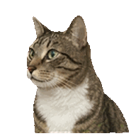
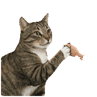
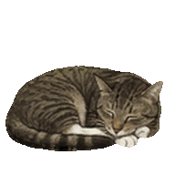
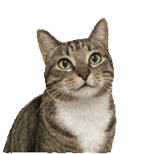
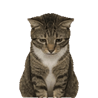
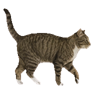
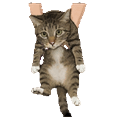
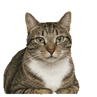

<p align="center">
  
</p>

<h1 align="center">TinyRoommate</h1>

<p align="center"><i>An AI pet that lives on your desktop.</i></p>

<p align="center">
  
  
  
  
</p>

<!-- TODO: add demo screenshot or GIF here -->

---

<br/>

You open the app. A small cat appears on your desktop. It walks around, sits down, yawns.

Every few minutes, a speech bubble pops up — sometimes random (*"~♪"*), sometimes surprisingly relevant (*"you've been coding since 9am... take a break?"*). You can pet it, talk to it, or just let it be.

<p align="center"><strong><em>A little friend that lives in the corner of your screen.<br/>Long hours feel shorter when you're not alone.</em></strong></p>

<br/>

<table>
<tr>
<td width="50%" valign="top">

**It sees what you see**<br/>
Screen capture + Claude Vision — knows if you're coding, designing, or doom-scrolling.

**It remembers you**<br/>
A living memory that grows over time. Not a stateless chatbot.

**It has personality**<br/>
Sassy, chill, philosophical — you configure it. Knows when to shut up.

</td>
<td width="50%" valign="top">

**It has feelings**<br/>
Pet it → purrs. Ignore it → it gets a little sad. It notices when you're around.

**It keeps a diary**<br/>
Plain Markdown files — its journal, what it saw on your screen, daily summaries. You can read them.

**100% local**<br/>
All data stays on your machine. Nothing leaves your laptop.

</td>
</tr>
</table>

<br/>

## Characters

Pick a companion — or **make your own**.

<p align="center">
  
  &nbsp;&nbsp;&nbsp;&nbsp;
  
  &nbsp;&nbsp;&nbsp;&nbsp;
  
  &nbsp;&nbsp;&nbsp;&nbsp;
  
  &nbsp;&nbsp;&nbsp;&nbsp;
  
  &nbsp;&nbsp;&nbsp;&nbsp;
  
</p>
<p align="center">
  <sub>Tabby Cat · Golden Retriever · Blue Buddy · Schnauzer · Tuxedo Cat · Coco</sub>
</p>

Each character has its own animations and voice lines. Want something different? Generate a spritesheet with any AI image tool (Gemini, Midjourney, etc.), drop it in, and it just works. See the **[Sprite Spec](SPRITE-SPEC.md)** for details.

To add a new pet like `Coco`, the repo convention is:

```bash
python3 -m pip install --user pillow numpy
python3 scripts/process-spritesheet-v4.py path/to/coco-source.png \
  -o public/sprites/coco.png \
  --cols 8 --rows 9 --target 128
python3 scripts/generate-preview-gif.py public/sprites/coco.png \
  -o assets/previews/coco.gif \
  --still-output assets/previews/coco.png
```

Then register `coco` in `src/characters.js`. The Settings picker is generated from that file automatically.

## A Day in Its Life

Your pet reacts to what's happening — not randomly, but contextually.

<div align="center">
<table>
<tr>
<td align="center" width="33%"><br/><sub><b>You're deep in code</b><br/>It works alongside you</sub></td>
<td align="center" width="33%"><br/><sub><b>You switch apps</b><br/>It notices and observes</sub></td>
<td align="center" width="33%"><br/><sub><b>You're watching YouTube</b><br/>It starts playing around</sub></td>
</tr>
<tr>
<td align="center"><br/><sub><b>It's past midnight</b><br/>"you should rest..." 💤</sub></td>
<td align="center"><br/><sub><b>You pet it</b><br/>Affection +1, purrs</sub></td>
<td align="center"><br/><sub><b>You've been away</b><br/>Hearts decay over time</sub></td>
</tr>
<tr>
<td align="center"><br/><sub><b>Nothing happening</b><br/>It wanders your desktop</sub></td>
<td align="center"><br/><sub><b>You drag it</b><br/>Swing physics, not amused</sub></td>
<td align="center"><br/><sub><b>Just vibing</b><br/>Silence is often the right choice</sub></td>
</tr>
</table>
</div>

---

## Quick Start

> **Note:** TinyRoommate currently runs on **macOS only**. Windows and Linux support is on the roadmap.

You need [Node.js](https://nodejs.org/) (v18+), [Rust](https://rustup.rs/), and [Claude Code](https://docs.anthropic.com/en/docs/claude-code) (for the AI brain).

```bash
gh repo fork ryannli/tinyroommate --clone
cd tinyroommate
npm install
npm run tauri:dev
```

`npm run tauri:dev` picks an open port automatically.
If you want to force a specific port, set `TAURI_DEV_PORT`:

```bash
TAURI_DEV_PORT=5180 npm run tauri:dev
```

If you are only running the frontend without Tauri, `npm run dev` also accepts a fixed port through `PORT`:

```bash
PORT=5180 npm run dev
```

<details>
<summary>Prerequisites</summary>

- [Node.js](https://nodejs.org/) v18+
- [Rust](https://rustup.rs/)
- [Claude Code](https://docs.anthropic.com/en/docs/claude-code) — for the AI brain (optional — pet still runs without it, just can't think or talk)

</details>

<details>
<summary>Screen Recording permission (optional)</summary>

For the pet to "see" your screen: **System Settings → Privacy & Security → Screen Recording** → enable your terminal app → restart terminal.

Without this, everything still works — it just can't see what you're doing.

</details>

<details>
<summary>Linux dependencies</summary>

```bash
sudo apt-get install -y \
  pkg-config libgtk-3-dev libwebkit2gtk-4.1-dev \
  libayatana-appindicator3-dev librsvg2-dev libssl-dev \
  fonts-noto-color-emoji
```

</details>

First launch compiles Rust (~2-3 min). After that it's instant.

---

## Interactions

| | |
|:--|:--|
| **Hold** on pet | It purrs |
| **Click** | Quick reaction |
| **Double-click** | Chat |
| **Drag** | Move it around |
| **Right-click** | Settings |

## Make It Yours

Right-click → **Settings** to change names and character.

For deeper customization, edit `.pet-data/config.md`:

```yaml
---
pet_name: Cooper
owner_name: Alex
sprite: golden_retriever
---

# Personality
- Be sarcastic and dry
- If I'm working past midnight, roast me

# Reminders
- Nudge me to take breaks every 30 min
```

Your pet reads this every time it thinks. Changes take effect immediately.

## Its Memory

All data lives in `.pet-data/` — plain Markdown you can read:

| File | |
|:-----|:--|
| **config.md** | Your preferences — edit this |
| **me-journal.md** | Its diary about life with you |
| **owner-memory.md** | What it knows about you |
| **owner-perceptions.md** | What it saw on your screen today |
| **owner-timeline.md** | Daily activity summaries |

---

<p align="center">
  <sub>Built with <a href="https://v2.tauri.app/">Tauri</a> · Vanilla JS · <a href="https://docs.anthropic.com/en/docs/claude-code">Claude Code</a></sub><br/>
  <sub>MIT License</sub>
</p>
